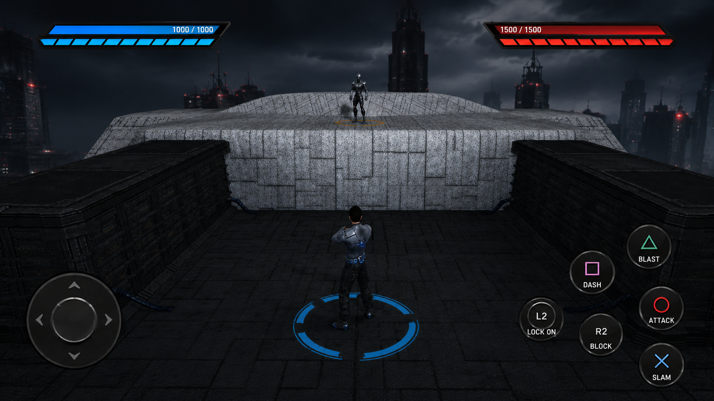
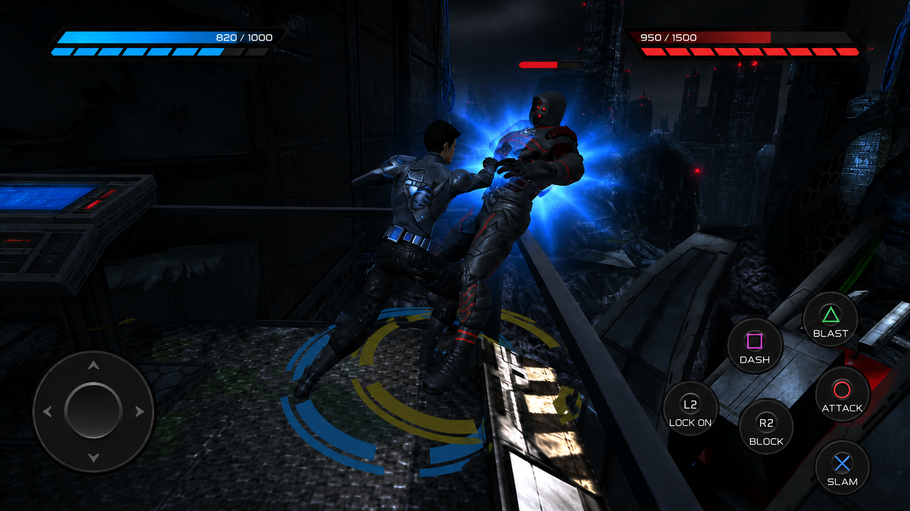

# G.ONE — The Game

<div align="center">

```
 ██████╗       ██████╗ ███╗   ██╗███████╗
██╔════╝      ██╔═══██╗████╗  ██║██╔════╝
██║  ███╗     ██║   ██║██╔██╗ ██║█████╗  
██║   ██║     ██║   ██║██║╚██╗██║██╔══╝  
╚██████╔╝     ╚██████╔╝██║ ╚████║███████╗
 ╚═════╝       ╚═════╝ ╚═╝  ╚═══╝╚══════╝
```

**A stylized, wave-based 3D combat game built with React Three Fiber.**  
**Inspired by PS3-era arcade fighters. Runs in your browser. Exports to Android.**


<br/>


</div>

---

## The Idea

G.ONE — The Game is a **wave-based 3D combat game** where you fight through increasingly brutal enemy waves. 

A punch that feels wrong is worse than an ugly punch. The screenshake, hit-stop, energy blasts, and dash trails exist because they make combat *satisfying*.

The game is built entirely in React + Three.js, ships as a PWA, and can be packaged as an Android APK with Capacitor.

---

## Gameplay Overview

You are G.One.

Each level of fighting is harder than the last. Enemies get faster, smarter, and more aggressive. Survive long enough and **Ra.One** spawns — complete with a rage mode that kicks in when its HP drops below 40%.

### The Loop

```
[Main Menu] → [Wave 1: Basic Enemies] → [Wave 2: Faster + Ranged] 
    → [Wave 3: Shield Enemies] → [BOSS WAVE] → [Score] → [Repeat]
```

### The Arena



### What You Can Do

| Action | Input (Mobile) | Input (Desktop) |
|---|---|---|
| Move | Left Virtual Joystick | WASD / Arrow Keys |
| Light Attack | Tap Attack Button | J |
| Heavy Attack | Hold Attack Button | K |
| Energy Blast | Blast Button | L |
| Dash | Double-tap Direction | Shift |
| Lock-On | Lock Button | Tab |
| Finisher | Finisher Button (when charged) | F |
| Pause | Pause Button | Esc |

### The Combat Feel

Every hit triggers a **2–4 frame hit-stop** — the entire game freezes for a fraction of a second. This single technique makes combat feel 10x heavier than it actually is. Combined with screen shake, bloom flash on energy blasts, and dash trails.


> *Live combat: energy blast connecting mid-fight. Blue bloom burst, health bars active, all 6 mobile buttons visible — BLAST, DASH, ATTACK, SLAM, LOCK ON, BLOCK.*

---

## PS3-Era Visual Inspiration

- Deep blacks with bright bloom highlights
- Neon outlines on geometry
- Particle explosions that feel *chunky*
- Arena stages that were simple but atmospheric

This game chases that exact feeling. The arena is intentionally **low-poly**. The lighting is **colored and dramatic**, not realistic.

Post-processing does the heavy lifting:
- **Bloom** makes energy attacks glow
- **Chromatic aberration** pulses on heavy hits
- **Vignette** keeps the focus center-stage

---

## 🛠️ Tech Stack

| Layer | Technology | Why |
|---|---|---|
| Framework | React 18 | Component-based game systems |
| 3D Engine | Three.js r158 | WebGL rendering |
| React Bridge | React Three Fiber (R3F) | Declarative Three.js |
| Post-Processing | `@react-three/postprocessing` | Bloom, chromatic aberration |
| Physics (light) | Custom collision detection | No heavy physics lib needed |
| UI | React DOM (overlay) | HUD, menus, mobile controls |
| Audio | Web Audio API + Howler.js | Sound effects + BGM |
| Build Tool | Vite 5 | Fast HMR, optimized builds |
| Android | Capacitor | PWA → Native APK |
| Asset Loading | Three.js GLTFLoader | GLB/GLTF models |

### Why React Three Fiber (not plain Three.js)?

Plain Three.js means manually managing scene graphs, object lifecycles, and update loops. R3F makes every 3D object a React component — so `Fighter.jsx`, `Enemy.jsx`, `Arena.jsx` all follow the same component lifecycle you already know.

```jsx
// Without R3F (plain Three.js)
const mesh = new THREE.Mesh(geometry, material);
scene.add(mesh);
// Remember to remove it on cleanup...
// Remember to update it in the animation loop...

// With React Three Fiber
<mesh ref={meshRef} position={[0, 0, 0]}>
  <boxGeometry args={[1, 2, 1]} />
  <meshStandardMaterial color="cyan" />
</mesh>
// Lifecycle handled by React. Clean. Declarative.
```

This is why the entire game can be composed like a UI app, not a traditional game engine.

---

## Combat System Breakdown

The combat system lives in **`src/components/combat/`** and is triggered by the player input layer in **`src/game/controls.js`**.

### Architecture

```
controls.js (input detection)
    ↓
Fighter.jsx (player state machine)
    ↓
EnergyBlast.jsx / EnemyProjectile.jsx (projectile spawning)
    ↓
effects/ (VFX triggered on hit/fire)
    ↓
HUD.jsx (health/energy display update)
```

### Player State Machine

The fighter is never in two states at once. This prevents animation blending bugs and makes the game feel snappy.

```
IDLE → MOVING → ATTACKING → (hit registers) → HIT_STOP → IDLE
              ↘ DASHING ↗
              ↘ FINISHER → FINISHER_FLASH → IDLE
```

### Hit Detection

Hit detection is **sphere-based** — each character has an attack sphere and a hitbox sphere. On overlap, damage is calculated:

```js
// Simplified hit logic inside Fighter.jsx
const attackSphere = new THREE.Sphere(attackOrigin, ATTACK_RADIUS);
const enemyHitbox  = new THREE.Sphere(enemy.position, ENEMY_HITBOX_RADIUS);

if (attackSphere.intersectsSphere(enemyHitbox)) {
  triggerHitStop(HIT_STOP_FRAMES);
  triggerScreenShake(0.4);
  enemy.takeDamage(playerAttackDamage);
}
```

No physics engine. No rigid body simulation. Just pure math.

### Energy Blast (`EnergyBlast.jsx`)

Energy blasts are **pooled projectile objects**. On fire:
1. A projectile spawns at the player's hand position
2. It travels along a forward vector each frame
3. On collision with an enemy hitbox → explosion, damage, `ExplosionEffect.jsx` spawns
4. If it misses the arena bounds → despawn

```jsx
// EnergyBlast.jsx — movement per frame
useFrame((_, delta) => {
  if (!active) return;
  meshRef.current.position.addScaledVector(direction, BLAST_SPEED * delta);
  checkCollisions();
  checkBoundsExpiry();
});
```

---

## Enemy AI System

Enemy AI lives in **`src/components/characters/Enemy.jsx`**.

It is a **Finite State Machine (FSM)** — the simplest AI that actually works well for arcade games.

### States

```
PATROL → (player in range) → CHASE → (attack range) → ATTACK
                                         ↓
                                    (takes damage) → STAGGER
                                         ↓
                                    (HP < 40%) → RAGE (boss only)
```

### State Logic (Simplified)

```js
// Enemy.jsx — FSM tick
function updateAI(delta) {
  switch (state) {
    case 'PATROL':
      moveToWaypoint(delta);
      if (distToPlayer < DETECTION_RADIUS) setState('CHASE');
      break;

    case 'CHASE':
      moveToward(playerPosition, CHASE_SPEED * delta);
      if (distToPlayer < ATTACK_RADIUS) setState('ATTACK');
      break;

    case 'ATTACK':
      if (attackCooldown <= 0) {
        fireProjectile();  // spawns EnemyProjectile.jsx
        attackCooldown = BASE_COOLDOWN;
      }
      break;

    case 'RAGE':           // boss only — faster, more projectiles
      attackCooldown = BASE_COOLDOWN * 0.5;
      moveToward(playerPosition, CHASE_SPEED * 1.8 * delta);
      break;
  }
}
```

### Boss Rage Mode

When the boss HP drops below **40%**, the FSM hard-switches to `RAGE`:
- Movement speed × 1.8
- Attack cooldown halved
- Projectile spread increases
- Visual: boss material shifts to red emissive, `ScreenShake` pulses

This single trigger completely changes how the fight feels — without any new animation or model.

### Wave Spawning (`FightScene.jsx`)

Waves are defined as config objects. `FightScene.jsx` reads the current wave index and spawns enemies accordingly:

```js
const WAVES = [
  { count: 3, type: 'basic',  speed: 1.0, hasBoss: false },
  { count: 5, type: 'ranged', speed: 1.2, hasBoss: false },
  { count: 4, type: 'shield', speed: 1.0, hasBoss: false },
  { count: 2, type: 'ranged', speed: 1.5, hasBoss: true  },
];
```

When all enemies in a wave are defeated, a short delay triggers the next wave — with a HUD announcement.

---

## VFX Pipeline

The effects system lives in **`src/components/effects/`**.

Every effect is a **self-contained, self-destructing component**. You render it, it plays, it removes itself. No global effect manager needed.

```
effects/
├── DashTrail.jsx       ← Ghost copies fading behind the player
├── ExplosionEffect.jsx ← Particle burst on projectile impact
├── FinisherFlash.jsx   ← Full-screen white flash on finisher
├── HitStop.jsx         ← Time-scale manipulator (freezes world)
├── ScreenShake.jsx     ← Trauma-based camera displacement
└── Shockwave.jsx       ← Expanding ring mesh on heavy impacts
```

### Why Modular?

Each effect is independent because:
- Effects can overlap (a finisher triggers flash + shockwave + hitstop simultaneously)
- Each can be tuned independently without breaking others
- They're composable — new effects = new file, no refactor

### `HitStop.jsx` — The Most Important Effect

Hit-stop is a technique from classic fighting games (Street Fighter, Tekken). When a hit lands, the entire scene stops updating for 2–5 frames. The player's brain registers this as "impact weight."

```jsx
// HitStop.jsx
useFrame(() => {
  if (hitStopFrames > 0) {
    // Pause all enemy animations, projectile movement
    worldRef.current.timeScale = 0;
    hitStopFrames--;
  } else {
    worldRef.current.timeScale = 1;
  }
});
```

### `ScreenShake.jsx` — Trauma System

Rather than simple random shake, this uses a **trauma accumulator**:

```js
// Add trauma on events
traumaRef.current = Math.min(1, traumaRef.current + amount);

// Each frame, decay trauma and apply displacement
useFrame(() => {
  trauma = Math.max(0, trauma - DECAY_RATE);
  const shake = trauma * trauma; // quadratic — feels more natural
  camera.position.x += shake * (Math.random() - 0.5) * MAX_SHAKE;
  camera.position.y += shake * (Math.random() - 0.5) * MAX_SHAKE;
});
```

Heavy hits add 0.6 trauma. Light hits add 0.2. The shake naturally decays — no abrupt cutoff.

### `DashTrail.jsx`

On dash, 4–6 ghost meshes spawn at the previous player positions with decreasing opacity:

```jsx
// Ghost copies fade from 0.6 → 0 opacity over 200ms
{ghosts.map((ghost, i) => (
  <mesh key={i} position={ghost.pos} opacity={ghost.opacity}>
    <clonedPlayerGeometry />
    <meshBasicMaterial color="cyan" transparent opacity={ghost.opacity} />
  </mesh>
))}
```

---

## Camera + Lock-On System

The camera lives in **`src/components/camera/ThirdPersonCamera.jsx`**.

### Default: Third-Person Follow

The camera follows the player with **spring damping** — it lags slightly behind, which feels natural during fast movement:

```js
// Exponential lerp — faster when far, slower when close
camera.position.lerp(targetPosition, 1 - Math.exp(-SPRING_STRENGTH * delta));
camera.lookAt(player.position);
```

### Lock-On Mode

When the player activates lock-on (Tab / Lock button):
1. The nearest enemy within `LOCK_ON_RADIUS` is selected
2. Camera pivots to frame both player and enemy
3. A targeting reticle appears on the enemy in the HUD
4. All attacks auto-orient toward the locked target

```js
// ThirdPersonCamera.jsx — lock-on pivot
if (lockOnTarget) {
  const midpoint = player.position.clone().lerp(lockOnTarget.position, 0.4);
  camera.position.set(midpoint.x, midpoint.y + 4, midpoint.z + 8);
  camera.lookAt(midpoint);
}
```

---

## Mobile Controls System

Mobile controls live in **`src/components/ui/MobileControls.jsx`** and are rendered as a **React DOM overlay** — completely separate from the Three.js canvas.

This is an important architectural decision: **UI is not in the 3D scene.** It floats above it as standard HTML.

### Virtual Joystick

The left joystick captures touch start/move/end events and converts them to a normalized direction vector:

```js
const handleTouchMove = (e) => {
  const dx = e.touches[0].clientX - joystickOrigin.x;
  const dy = e.touches[0].clientY - joystickOrigin.y;
  const angle = Math.atan2(dy, dx);
  const dist  = Math.min(Math.hypot(dx, dy), MAX_RADIUS);

  moveDirection.set(
    Math.cos(angle) * (dist / MAX_RADIUS),
    Math.sin(angle) * (dist / MAX_RADIUS)
  );
};
```


### Device Detection (`src/utils/device.js`)

Controls are conditionally rendered based on device detection:

```js
export const isMobile = () =>
  /Android|iPhone|iPad|iPod/i.test(navigator.userAgent) ||
  (navigator.maxTouchPoints > 1);
```
---

## Android Deployment

The game exports to Android using **Capacitor** — it wraps the web build into a native WebView APK.


### Performance Notes for Android

- **Target API 33+** (Android 13) for best WebGL support
- Enable **hardware acceleration** in `AndroidManifest.xml`
- Use **`lowPowerMode`** in Three.js renderer on battery-saving devices
- Disable post-processing bloom on devices with < 4GB RAM

```js
// device.js — conditional quality
export const qualityTier = () => {
  const mem = navigator.deviceMemory || 4;
  if (mem <= 2) return 'low';
  if (mem <= 4) return 'medium';
  return 'high';
};
```

---

## Repo Architecture Explained

```
src/
│
├── audio/
│   └── sounds.js              ← All sound effect definitions + BGM loader
│
├── components/
│   │
│   ├── camera/
│   │   └── ThirdPersonCamera.jsx   ← Follow cam + lock-on logic
│   │
│   ├── characters/
│   │   ├── Fighter.jsx         ← Player: movement, attacks, state machine
│   │   └── Enemy.jsx           ← Enemy: FSM AI, health, projectile firing
│   │
│   ├── combat/
│   │   ├── EnergyBlast.jsx     ← Player projectile (travel + collision)
│   │   └── EnemyProjectile.jsx ← Enemy projectile (different speed/damage)
│   │
│   ├── effects/
│   │   ├── DashTrail.jsx       ← Ghost trail on dash
│   │   ├── ExplosionEffect.jsx ← Particle burst on impact
│   │   ├── FinisherFlash.jsx   ← Full-screen white flash
│   │   ├── HitStop.jsx         ← Time freeze on heavy hits
│   │   ├── ScreenShake.jsx     ← Trauma-based camera shake
│   │   └── Shockwave.jsx       ← Expanding ring mesh
│   │
│   ├── environment/
│   │   ├── Arena.jsx           ← Floor, walls, boundary colliders
│   │   ├── Lighting.jsx        ← Colored point lights + ambient
│   │   └── NeonArena.jsx       ← Neon trim geometry + emissive materials
│   │
│   └── ui/
│       ├── GameOver.jsx        ← Game over screen + score
│       ├── HUD.jsx             ← Health bar, energy bar, wave counter
│       ├── MainMenu.jsx        ← Title screen + start button
│       ├── MobileControls.jsx  ← Virtual joystick + touch buttons
│       └── PauseMenu.jsx       ← Pause overlay + resume/quit
│
├── game/
│   └── controls.js             ← Input abstraction (keyboard + touch)
│
├── scenes/
│   └── FightScene.jsx          ← Master orchestrator: spawning, waves, game state
│
├── utils/
│   └── device.js               ← Device detection + quality tier selection
│
├── App.jsx                     ← Route between menu / game / gameover
└── main.jsx                    ← Vite entry point, React root mount
```

---

Characters and combat are **separated intentionally**.

`Fighter.jsx` knows: "I am the player. I can move, I can attack, I have health."  
`EnergyBlast.jsx` knows: "I am a projectile. I travel, I collide, I disappear."

If you put projectile logic inside `Fighter.jsx`, it becomes a 600-line monster. Separating them means each file does exactly one thing. Want to add a new projectile type? New file in `combat/`. Fighter doesn't change.

### `effects/` are isolated for composability

VFX effects are the most frequently changed, tuned, and replaced systems in any game. Isolating each one means:
- Tune `ScreenShake.jsx` without touching anything else
- Replace `ExplosionEffect.jsx` with a particle version later
- Stack multiple effects simultaneously (finisher = flash + shockwave + hitstop)

### `scenes/` orchestrates, doesn't implement

`FightScene.jsx` is the **director**, not an actor. It manages:
- Which wave is active
- When to spawn enemies
- When the boss appears
- Game state transitions (playing → gameover)

It imports everything else but implements almost nothing itself. This is intentional — it's the "glue layer."

### `ui/` is React DOM, not Three.js

All UI (HUD, menus, mobile controls) is standard HTML/CSS rendered over the canvas. This means:
- UI is accessible (screen readers, contrast)
- UI uses CSS animations (no Three.js overhead)
- UI can be styled with normal tools (Tailwind, CSS modules)

---

## Rendering Pipeline

```
React Three Fiber Canvas
    │
    ├── Scene
    │   ├── Lighting.jsx      (point lights, ambient, directional)
    │   ├── NeonArena.jsx      (emissive geometry — glows without post-processing)
    │   ├── Arena.jsx          (collision boundaries, floor)
    │   ├── Fighter.jsx        (player mesh + attack colliders)
    │   ├── Enemy.jsx × N      (enemy meshes, N = current wave count)
    │   ├── EnergyBlast.jsx × M (active projectiles)
    │   └── effects/           (active VFX components)
    │
    └── EffectComposer (post-processing)
        ├── Bloom              (threshold: 0.8, intensity: 1.2)
        ├── ChromaticAberration (offset on hit events)
        └── Vignette           (darkness: 0.5, offset: 0.2)
```

### Frame Lifecycle

Every frame (60fps target):

1. `useFrame` callbacks fire across all components
2. Input is read from `controls.js` state
3. Fighter position updates, attack spheres recalculate
4. Enemy FSMs tick, projectiles move
5. Collision checks run
6. VFX components update (shake, trail, particles)
7. Three.js renders the scene
8. Post-processing stack runs on the framebuffer
9. React DOM HUD renders over canvas

---

## Performance Optimizations

Running 3D in a browser (especially mobile) demands aggressive optimization.

### Object Pooling

Projectiles and explosion particles are pooled — created once, reused forever:

```js
// EnergyBlast.jsx — don't create/destroy, reuse
const pool = useRef([]);
const getBlast = () => pool.current.find(b => !b.active) || createNewBlast();
const releaseBlast = (blast) => { blast.active = false; };
```

### Geometry Instancing

When many enemies share the same shape, `InstancedMesh` renders all of them in a single draw call:

```jsx
// Enemy.jsx — instanced rendering
<instancedMesh ref={instancedRef} args={[geometry, material, MAX_ENEMIES]}>
  {/* Positions updated via instancedRef.current.setMatrixAt() */}
</instancedMesh>
```

Without instancing: N enemies = N draw calls. With instancing: N enemies = 1 draw call.

### LOD (Level of Detail)

```js
// High detail: < 15 units from camera
// Low detail:  > 15 units from camera
// Culled:      > 50 units from camera
```

Implemented via R3F's `<Lod>` component.

### Shadow Budget

Shadows are disabled by default. On high-tier devices, one directional shadow is enabled with a low shadow map resolution (512×512).

---

## How Waves & Bosses Work

Wave logic lives in **`FightScene.jsx`**.

### Wave Config

```js
const WAVES = [
  {
    id: 1,
    enemies: [
      { type: 'basic',  count: 3, spawnDelay: 500  },
    ],
    bossWave: false,
  },
  {
    id: 2,
    enemies: [
      { type: 'basic',  count: 2, spawnDelay: 300  },
      { type: 'ranged', count: 2, spawnDelay: 1000 },
    ],
    bossWave: false,
  },
  {
    id: 3,
    enemies: [
      { type: 'shield', count: 3, spawnDelay: 400  },
      { type: 'ranged', count: 2, spawnDelay: 800  },
    ],
    bossWave: false,
  },
  {
    id: 4,
    enemies: [],
    bossWave: true,
    boss: { type: 'raone', hp: 500, rageThreshold: 0.4 },
  },
];
```

### Wave Transition

```js
// FightScene.jsx
const onEnemyDefeated = () => {
  aliveCount--;
  if (aliveCount <= 0) {
    setTimeout(() => {
      currentWave++;
      spawnWave(WAVES[currentWave]);
      showWaveAnnouncement(currentWave);
    }, WAVE_TRANSITION_DELAY);
  }
};
```

### Ra.One Entry

Ra.One spawns with a cinematic: camera pulls back, screen flashes, boss drops from above the arena. The `FinisherFlash.jsx` component is reused for the spawn flash.

---

## Audio System

Audio lives in **`src/audio/sounds.js`**.

The system uses **Howler.js** for sound management:

```js
// sounds.js
import { Howl, Howler } from 'howler';

export const SFX = {
  hit:         new Howl({ src: ['sfx/hit.mp3'],      volume: 0.8 }),
  blast:       new Howl({ src: ['sfx/blast.mp3'],    volume: 0.6 }),
  dash:        new Howl({ src: ['sfx/dash.mp3'],     volume: 0.5 }),
  explosion:   new Howl({ src: ['sfx/explosion.mp3'], volume: 0.9 }),
  finisher:    new Howl({ src: ['sfx/finisher.mp3'], volume: 1.0 }),
  bossRage:    new Howl({ src: ['sfx/rage.mp3'],     volume: 1.0 }),
};

export const BGM = new Howl({
  src: ['music/arena_theme.mp3'],
  loop: true,
  volume: 0.4,
});
```

Sound effects are triggered directly from component events — no global bus needed for a project of this scale.

---

## Animation Pipeline

Currently, character animations are **procedural** — built from code, not pre-made animation files. This was a deliberate early choice: no asset dependencies, no rigging, instant iteration.

### Procedural Animations

```js
// Fighter.jsx — attack animation (procedural)
useFrame(({ clock }) => {
  if (isAttacking) {
    const t = clock.getElapsedTime() - attackStart;
    armRef.current.rotation.x = Math.sin(t * 20) * 0.8; // swing
    if (t > ATTACK_DURATION) setAttacking(false);
  }
});
```

##  How the Models Are Loaded

Models use R3F's `useGLTF` hook with **Draco compression** for mobile:

```jsx
import { useGLTF } from '@react-three/drei';

// Draco-compressed GLB — ~70% smaller file size
const Fighter = () => {
  const { scene } = useGLTF('/models/fighter.glb', true); // true = Draco
  return <primitive object={scene} />;
};

// Preload for zero loading screen
useGLTF.preload('/models/fighter.glb');
```
---

## Screenshots

| | |
|---|---|
|  |  |
| **Main Menu** | **Arena — Wave Start** |
|  | |
| **Live Combat** | |

---


Made by C.Kumaran

</div>
